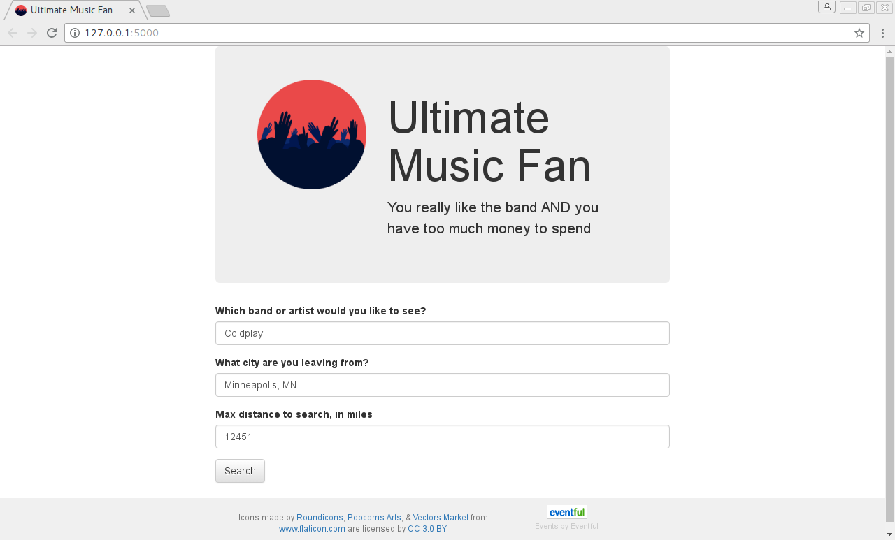
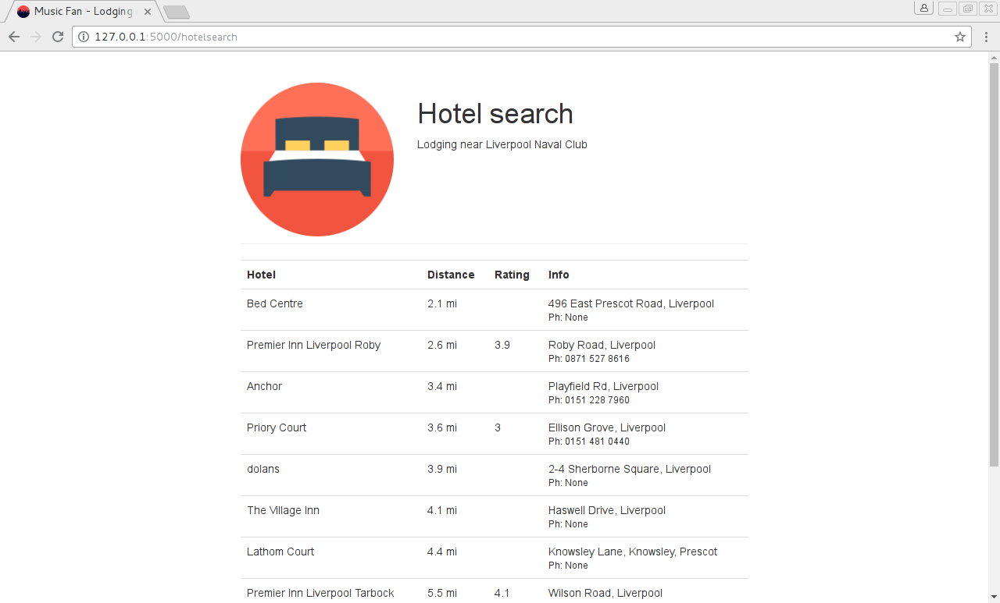

# Ultimate Music Fan #

ITEC2905 Project 4

Entertainment travel web app: Pick your favorite band, find out where they are playing, how you can get there, and where you can stay

[Larry](https://github.com/lplade), 
[Boris](https://github.com/BorisVV), 
[Branden](https://github.com/yp0975eu)
## Technologies used ##
Python, Flask, Werkzeug caching, Jinja2 templating, web APIs, Bootstrap

## Screenshots ##
### Band search ###

### Event selection ###

### Hotel list ###

## Setup ##
Run setup.py to install dependencies from PyPI. This should also copy the file "secrets_template.py" to "secrets.py".

Fill in secret keys in secrets.py as appropriate.

### Required Keys ###
* [Eventful API](http://api.eventful.com/keys) (Free account required)
* [Google Maps API](https://developers.google.com/maps/documentation/geocoding/get-api-key) (Google account required)
* [Google Places API](https://developers.google.com/places/web-service/get-api-key) (Google account required)
* Skyscanner (not fully implemented)

## Reference ##
* [Google Geocoding API](https://developers.google.com/maps/documentation/geocoding/intro) (to determine starting location)
* [Google Places API Web Services](https://developers.google.com/places/web-service/) (for lodging search)
* [python-google-places](https://github.com/slimkrazy/python-google-places)
* [Flask](http://flask.pocoo.org/docs/0.12/)
* [Bootstrap](http://getbootstrap.com/css/)
